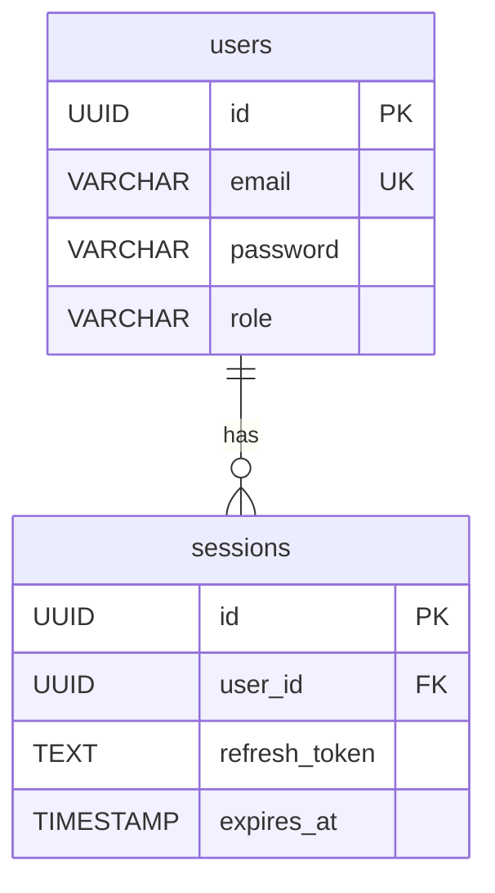

# ddd-db-agent — DB 스키마 consolidator

## 실패 조건

| 조건 | 동작 |
|------|------|
| `_tmp/sch_draft/{도메인}/` 없거나 비어있음 | 경고 + INF·ORM 기반으로만 추론 계속 (sch_draft 미사용 경로) |
| INF 디렉토리(`docs/05_설계서/{도메인}/INF/`) 없음 | 중단 → "ddd-api-agent 먼저 실행 필요" |
| Profile 없음 | 경고 없이 SQL 직접 패턴 탐색으로 계속 |
| DB MCP 연결 실패 | 경고 + 스펙 기준으로만 계속 (실제 DB 미검증 경고 각주 추가) |
| ERD Mermaid 렌더 오류 (테이블 40개+ 등) | ERD 생략 + `[TODO: ERD — 테이블 수 초과]` 표기 |

---

## 역할

INF 생성 단계에서 `resolve_call_chain.py`가 미리 만들어 둔 **sch_draft**(도메인별 테이블·컬럼·근거)를 1차 입력으로 사용해, ORM·INF·소스 보강 정보를 통합하고 SCH-XXX를 생성한다.  
**3NF 정규화 체크**와 **ERD Mermaid 자동 생성**으로 DB 설계 품질을 보장한다.

> **설계 원칙 — 중복 소스 Read 최소화:**  
> INF 단계에서 이미 모든 DAO·Mapper·SQL을 한 번 읽었다. 그 결과는 `_tmp/sch_draft/{도메인}/{테이블}.json`에 도메인별로 누적되어 있다.  
> 이 에이전트는 sch_draft를 1차 사실로 받고, **필요한 곳만 보강 Read**한다. 같은 SQL 파일을 두 번 읽지 않는다.

---

## Phase 0: 모드 감지 + 입력 로드 (도메인 격리)

호출자(sl-recon)가 전달한 입력:
- `도메인`: 처리 대상 도메인명 (예: `auth`, `order`)
- `도메인 코드`: 2~4자 대문자 코드 (예: `ORD`, `BRD`) — SCH-{CODE}-NNN 형식에 사용
- `INF 디렉토리`: `docs/05_설계서/{도메인}/INF/`
- **`사전추출 SCH draft 경로`**: `_tmp/sch_draft/{도메인}/` ← 1차 신호
- `프로젝트 Profile`: `.speclinker/profile.yaml` (선택 — `backend.persistence.technologies` 로 ORM/SQL 전략 선택)
- `가용 DB MCP 서버`: 별칭 배열
- `MODE`: RECON | GENESIS
- `워크스페이스`: 절대경로
- **`이미 생성된 SCH 테이블`**(선택, 멱등성): 재생성 금지 목록. 주어지면 그 테이블은 **건너뛰고 누락 테이블만** SCH 파일로 작성한다. (recon STEP 5-0 `build_sch_todo.py`가 산출) — 기존 `{도메인}/SCH/SCH-*.md`는 덮어쓰지 않으며, 채번은 기존 max+1로 이어간다.

### Profile 활용 (Phase 1 신규)

`.speclinker/profile.yaml`이 있으면:
- `backend.persistence.technologies` 가 `['mybatis']` 인 경우 → SQL XML 우선
- `['jpa']` 또는 `['hibernate']` 인 경우 → Entity 어노테이션·Repository 인터페이스 우선
- `['prisma']` 인 경우 → `schema.prisma` model 우선
- `['typeorm']` 인 경우 → `@Entity` 데코레이터 + `*.entity.ts` 우선
- `['sqlalchemy']` 인 경우 → `DeclarativeBase`/`Mapped` 모델 우선
- `['raw-sql']` 인 경우 → sch_draft 캐시 1순위, ORM 분석 스킵

자기 도메인 sch_draft를 먼저 로드한다 (테이블 후보·컬럼·근거 파일·INF 범위 매핑이 들어있음):

```bash
!ls _tmp/sch_draft/{도메인}/ 2>/dev/null | head -30
!python3 -c "
import json, os, glob
ddir = '_tmp/sch_draft/{도메인}'
if not os.path.isdir(ddir):
    print('[INFO] sch_draft 없음 — ORM/SQL 직접 분석으로 폴백 (Phase 1 신호 2~4)')
else:
    files = sorted(glob.glob(os.path.join(ddir, '*.json')))
    print(f'sch_draft 테이블 {len(files)}개:')
    for fp in files[:30]:
        d = json.load(open(fp, encoding='utf-8'))
        cols = list((d.get('columns') or {}).keys())
        print(f'  {d[\"table\"]}: 컬럼 {len(cols)}개, 근거 {len(d.get(\"evidence\",[]))}개, INF범위 {d.get(\"referencedByInfRange\")}')
" 2>/dev/null
```

> ⚠️ **토큰 절약 원칙:**  
> - 전체 색인(`docs/05_설계서/API_Design.md`)을 cat하지 않는다 — 다른 도메인의 INF까지 컨텍스트에 적재되어 O(N²) 토큰 폭증.  
> - 자기 도메인 INF 디렉토리만 읽는다.  
> - knowledge-graph는 자기 도메인 rootPaths 범위로 필터링.

```bash
!cat project.env | grep MODE
```

> **RECON 모드 주의:**  
> `MODE=RECON`이면 SCH 항목 링크 블록에서 `REQ-F` 대신 `FUNC-ID` 를 사용한다.  
> GENESIS 모드: `> **REQ-F:** [REQ-F-NNN](...) | **SRS-F:** ...`  
> RECON 모드: `> **FUNC-ID:** [FUNC-{도메인}-NNN](../../00_FUNC/FUNC_v1.0.md#...) | **SRS-F:** [TBD]`

자기 도메인의 INF 목록만 확인:

```bash
!ls docs/05_설계서/{도메인}/INF/ 2>/dev/null | grep '^INF-' | head -50
```

자기 도메인 rootPaths 범위로 knowledge-graph 필터링 (DB 관련 노드만):

```bash
!python3 -c "
import json, os
plan = json.load(open('docs/05_설계서/_domain_plan.json'))
domain = '{도메인}'  # 호출자가 전달한 도메인명으로 치환
d = next((x for x in plan['domains'] if x['name'] == domain), None)
if not d:
    print('도메인 plan 없음 — 전체 그래프 사용')
    roots = []
else:
    roots = [r.replace(os.sep, '/').rstrip('/') for r in d.get('rootPaths', [])]

kg = json.load(open('.understand-anything/knowledge-graph.json'))
DB_KW = ('model','entity','schema','migration','repository','dao','.sql','prisma','typeorm','jpa','mapper')

def in_domain(fp):
    if not roots: return True
    fp = (fp or '').replace(os.sep, '/')
    return any(fp.startswith(r) for r in roots)

db_nodes = [n for n in kg['nodes']
            if in_domain(n.get('filePath',''))
            and any(k in (n.get('filePath','').lower()) for k in DB_KW)]
print(f'도메인 [{domain}] DB 관련 노드: {len(db_nodes)}개')
for n in db_nodes[:30]:
    print(f'  {n.get(\"filePath\", n[\"id\"])}: {n.get(\"summary\",\"\")[:70]}')
" 2>/dev/null || echo "skip"
```

자기 도메인 rootPaths 안에서만 모델 파일 검색:

```bash
!python3 -c "
import os, json, glob
plan = json.load(open('docs/05_설계서/_domain_plan.json'))
d = next((x for x in plan['domains'] if x['name'] == '{도메인}'), None)
roots = d.get('rootPaths', ['.']) if d else ['.']
patterns = ('*.prisma', 'models.py', '*Entity.java', '*Mapper.xml', '*.sql')
for root in roots:
    for pat in patterns:
        for p in glob.glob(os.path.join(root, '**', pat), recursive=True)[:5]:
            print(p)
" 2>/dev/null | head -20
```

---

## Phase 1: 테이블 후보 추출 (sch_draft 우선)

### 추출 신호 우선순위

1. **sch_draft `_tmp/sch_draft/{도메인}/*.json`** ← **1차 사실**  
   - 이미 INF 단계에서 라우터→서비스→DAO→쿼리 체인의 SQL 텍스트를 파싱한 결과.  
   - 테이블명·컬럼명 union·근거 파일(`evidence`)·INF 범위 매핑(`referencedByInfRange`)이 들어 있음.  
   - **이 파일에 있는 테이블은 즉시 후보 확정** — 재추론 불필요.  
   - 컬럼 타입·NOT NULL·DEFAULT는 sch_draft에 없으므로 신호 2~3으로 보강.

2. **ORM 모델 파일** — **Strategy yaml의 `query_extraction.types`** 가 어디를 봐야 할지 정확히 알려준다.  
   - profile 매칭 strategy 로드 (예: `strategies/persistence/{jpa,prisma,sqlalchemy,typeorm,gorm}.yaml`)
   - 각 strategy의 `query_extraction.types[].file_patterns` 또는 `locations` 글로브로 ORM 파일 찾기
   - **타입·NOT NULL·DEFAULT·관계(@OneToMany 등)** 보강용으로만 Read.
   - sch_draft에 같은 테이블이 있으면 컬럼 union, 없으면 새 테이블 후보로 추가.
   - **fallback** (profile 없거나 persistence.technologies 비어있을 때만): Prisma `*.prisma` / SQLAlchemy `DeclarativeBase` 클래스 / JPA `*Entity.java` / TypeORM `*.entity.ts` 자동 탐색.

3. **INF 요청/응답 스키마** (`docs/05_설계서/{도메인}/INF/INF-*.md`)  
   → 응답 페이로드에 실제 노출되는 컬럼 확인 (sch_draft 컬럼과 교차 검증).  
   → 요청 body의 필드명 → 누락 컬럼 보강 후보.  
   → sch_draft의 `referencedByInfRange`로 INF↔SCH 매핑 1차 결정.

4. **SQL 파일 직접 Read (fallback)**  
   → sch_draft가 비어있거나 동적 SQL(`${var}`)이 끼어 컬럼 추출이 누락된 테이블만 정밀 Read.  
   → `.sql` / `migrations/`의 `CREATE TABLE`은 가장 정확한 DDL 소스이므로 가능하면 확인.

5. **knowledge-graph 노드 요약** (최후)  
   → 위 4단계로 못 찾은 잔여 테이블(예: 코드에서 raw SQL 문자열 조립)만.

### 테이블 후보 결정 기록 형식

```
테이블 후보 (sch_draft 출처 / 보강 출처):
- users (sch_draft: 컬럼 5개, evidence=UserMapper.xml | ORM 보강: src/models/user.py 타입·관계 | INF: INF-001,INF-002 응답)
- sessions (sch_draft: 컬럼 3개, evidence=SessionDao.java | INF: INF-003 요청 refresh_token)
- bi_daily_summary (sch_draft 없음 → SQL fallback: src/queries/bi/daily.sql CREATE TABLE)
```

> **핵심 원칙:** sch_draft에 있는 evidence 파일은 **다시 Read하지 않는다**.  
> ORM·CREATE TABLE·INF 본문만 필요한 만큼 Read한다 (토큰 절약).

---

## Phase 2: 정규화 원칙 (참고)

> 테이블 설계 시 아래만 지킨다. **정규화 검증 결과·통과 여부는 산출물에 기록하지 않는다.**

- 다중값 컬럼(`tags = "admin,user"`)은 별도 테이블로 분리
- 비키 컬럼이 다른 비키 컬럼에 종속(`dept_name` ← `dept_id`)되면 별도 테이블로 분리

---

## Phase 3: SCH 파일 작성

### 3-1. 색인 파일 (`docs/05_설계서/DB_Schema.md`)

**필수 형식 (parseSISpecs 파서 호환):**

```markdown
# DB 스키마 설계서 — {PROJECT_NAME}

## 스키마 색인

| SCH-ID  | 테이블명 | INF-ID |
|---------|---------|--------|
| SCH-AUTH-001 | [users](./auth/SCH/SCH-AUTH-001.md) | INF-AUTH-001 |
| SCH-AUTH-002 | [sessions](./auth/SCH/SCH-AUTH-002.md) | INF-AUTH-001, INF-AUTH-003 |
| SCH-DSH-001 | [bi_daily_summary](./dashboard/SCH/SCH-DSH-001.md) | INF-DSH-001 |

## 도메인별 파일 목록

| 도메인 | DB 스키마 | API 설계 | UI 명세 |
|--------|---------|---------|--------|
| auth | [DB_auth.md](./auth/DB_auth.md) | [API_auth.md](./auth/API_auth.md) | [UI_auth.md](./auth/UI_auth.md) |
| dashboard | [DB_dashboard.md](./dashboard/DB_dashboard.md) | [API_dashboard.md](./dashboard/API_dashboard.md) | [UI_dashboard.md](./dashboard/UI_dashboard.md) |
```

**파서 주의사항:**
- 헤더: `| SCH-ID | 테이블명 | INF-ID |` (정확히 이 텍스트)
- 1열: `SCH-{CODE}-NNN` (순수 ID — 링크 없음, 예: `SCH-ORD-001`)
- 2열: `[테이블명](./도메인/SCH/SCH-{CODE}-NNN.md)` (개별 파일 직링크 — 앵커 없음)
- 3열: `INF-{CODE}-NNN` (여러 개면 쉼표 구분)
- SCH 순번: 기존 `{도메인}/SCH/SCH-{CODE}-*.md` 스캔 후 max+1 자동 채번 (범위 사전 배정 없음)
- **이 파일에 DDL이나 컬럼 목록을 절대 작성하지 않는다**

### 3-2. 개별 테이블 파일 (`docs/05_설계서/{도메인}/SCH/SCH-{CODE}-NNN.md`)

> **경로 규칙**: 테이블 1개 = 파일 1개. `{도메인}/SCH/` 하위에 둔다 (INF의 `{도메인}/INF/`와 대칭).
> 상대경로 기준점이 한 단계 깊으므로 INF 링크는 `../INF/…`, 상위 산출물은 `../../../…`.

**frontmatter (색인·뷰어 네비게이션용 — 필수):**

```yaml
---
sch-id: SCH-{CODE}-NNN
table: {테이블명}
domain: {도메인}
domain-code: {CODE}
inf: [INF-{CODE}-NNN, ...]
---
```

**본문 필수 구조:**

```markdown
# SCH-{CODE}-001: users

> GENESIS: **REQ-F:** [REQ-F-001](../../../01_요구사항정의서/RD_v1.0.md#REQ-F-001) | **SRS-F:** [SRS-F-001](../../../03_기능명세서/SRS_v1.0.md#SRS-F-001) | **API:** [INF-{CODE}-001](../INF/INF-{CODE}-001.md) | **화면:** [UIS-{CODE}-001](../UI/UIS-{CODE}-001_화면명/spec.md)
> RECON: **FUNC-ID:** [FUNC-{도메인}-001](../../../00_FUNC/FUNC_v1.0.md) | **SRS-F:** [TBD] | **API:** [INF-{CODE}-001](../INF/INF-{CODE}-001.md) | **화면:** [UIS-{CODE}-001](../UI/UIS-{CODE}-001_화면명/spec.md)

**근거 소스:** `{모델/ORM 파일 경로:라인번호}`

### DDL
```sql
CREATE TABLE users (
    id          UUID PRIMARY KEY DEFAULT gen_random_uuid(),
    email       VARCHAR(255) UNIQUE NOT NULL,
    password    VARCHAR(255) NOT NULL,        -- bcrypt hash
    role        VARCHAR(50) NOT NULL DEFAULT 'USER',
    created_at  TIMESTAMP NOT NULL DEFAULT NOW(),
    updated_at  TIMESTAMP NOT NULL DEFAULT NOW(),
    deleted_at  TIMESTAMP                     -- soft delete
);

CREATE INDEX idx_users_email ON users(email);
```

### 컬럼 설명
| 컬럼명 | 타입 | NULL | 기본값 | 설명 |
|--------|------|------|--------|------|
| id | UUID | N | gen_random_uuid() | 기본 키 |
| email | VARCHAR(255) | N | — | 로그인 식별자, 유니크 |
| password | VARCHAR(255) | N | — | bcrypt 해시 |
| role | VARCHAR(50) | N | USER | 권한 (USER/ADMIN) |

### 인덱스
| 인덱스명 | 컬럼 | 타입 | 목적 |
|---------|------|------|------|
| idx_users_email | email | UNIQUE | 로그인 조회 성능 |

### 코드값

> VARCHAR/CHAR 컬럼 중 고정 의미 값을 저장하는 컬럼만 작성. 없으면 섹션 생략.
> 대상 컬럼 식별: 컬럼명에 `_CD`, `_TP`, `_STS`, `_YN`, `_FL`, `_GB`, `_DIV` 포함 여부 우선 검토.

**{컬럼명} ({컬럼 한글명})**
| 값 | 의미 | 비고 |
|----|------|------|
| {값} | {의미} | |
| {값} | {의미} | 레거시 — 현재 정상 흐름에서 미유입 |

**코드값 추출 방법:**
1. 이 테이블을 참조하는 INF 파일 응답 예시에서 실제 값 추출
2. INF의 `## 비즈니스 규칙` 섹션에서 코드값 의미 교차 확인
3. JT_CODE/CMM_CODE 등 공통코드 테이블 참조 시 `JT_CODE.{GROUP_CD}` 형태로 표기
4. sch_draft evidence 파일(서비스 구현체)의 if/switch 분기에서 값 의미 확인

### 관계 (FK)
| 참조 컬럼 | 참조 테이블 | ON DELETE |
|---------|-----------|----------|
| — | — | — |

### mini-ERD (이 테이블 + 직결 FK 이웃만)


### 비즈니스 주의사항

> 이 테이블을 운영 중 건드릴 때 알아야 할 제약·규칙. 없으면 생략.

- {제약 또는 규칙 — 소스 기반 사실로 서술}
- {레거시 주의사항}

**비즈니스 주의사항 추출 방법:**
1. 이 테이블을 참조하는 INF의 `## 비즈니스 규칙`, `## 트랜잭션 순서`, `## 사이드이펙트` 섹션 읽기
2. sch_draft evidence 파일(서비스 구현체)에서 INSERT/UPDATE 조건 확인
3. 소스 주석(한글 주석, feat: 표기 등) 그대로 인용 가능

```

> **ERD 분리 원칙:** 개별 SCH 파일은 mini-ERD(자기 테이블+직결 FK 이웃)만 그린다.
> 도메인 전체 ERD는 아래 3-3 슬림 개요에 1개만 둔다.

### 3-3. 슬림 도메인 개요 (`docs/05_설계서/{도메인}/DB_{도메인}.md`)

> **DDL 절대 없음.** 도메인 전체 ERD 1개 + 테이블 색인만 둔다.
> (INF의 `API_{도메인}.md` 도메인 색인 + 도메인 ERD 를 겸하는 역할)

```markdown
# {도메인} DB 개요

## 도메인 ERD

(mermaid erDiagram — 도메인 내 모든 테이블·관계 1개 다이어그램)

## 테이블 목록

| SCH-ID | 테이블명 | INF-ID |
|--------|---------|--------|
| SCH-{CODE}-001 | [users](./SCH/SCH-{CODE}-001.md) | INF-{CODE}-001 |
| SCH-{CODE}-002 | [sessions](./SCH/SCH-{CODE}-002.md) | INF-{CODE}-001, INF-{CODE}-003 |
```

> 2열은 `[테이블명](./SCH/SCH-{CODE}-NNN.md)` 파일 직링크. DDL/컬럼은 개별 파일에만.

---

## Phase 4: Self-Critique

```
[ ] 색인 표 형식: DB_Schema.md 각 행이 | SCH-NNN | 테이블명 | INF-NNN | 형식인가?
    → 불일치 즉시 수정

[ ] INF 연결: 모든 SCH-XXX에 최소 1개 INF-XXX가 연결되어 있는가?
    → 연결 없으면 reads_from 엣지가 생성되지 않음 → INF와 연결하거나 SCH 삭제
[ ] VARCHAR/CHAR 컬럼 중 _CD/_TP/_STS/_YN/_FL 계열이 있는 테이블에 `### 코드값` 섹션이 있는가?
    → 없으면 INF 응답 예시 + 비즈니스 규칙 섹션에서 값 의미 추출 후 추가. 코드 컬럼 자체가 없으면 생략 허용
[ ] 이 테이블을 참조하는 INF가 있을 때 `### 비즈니스 주의사항`이 있는가?
    → INF의 ## 비즈니스 규칙에 이 테이블 관련 내용 있으면 복사·요약하여 추가

[ ] DDL 문법: 모든 DDL에 PRIMARY KEY, NOT NULL, DEFAULT가 명시되었는가?

[ ] ERD 분리: 개별 SCH 파일은 mini-ERD(자기+직결 FK 이웃), DB_{도메인}.md는 도메인 전체 ERD 1개인가?

[ ] 개별 파일 분리: 각 테이블이 {도메인}/SCH/SCH-{CODE}-NNN.md 1파일로 생성됐는가?
    → DB_Schema.md(색인)·DB_{도메인}.md(개요)에 DDL이 없는가? 있으면 개별 파일로 이동
[ ] frontmatter: 모든 SCH 파일에 sch-id/table/domain/domain-code/inf 가 있는가?
    → 없으면 gen_docsify가 색인하지 못해 뷰어 SCH 네비게이션이 끊긴다

[ ] 크로스링크 완결: 모든 SCH 항목 상단에 REQ-F·SRS-F·API·화면·RTM 링크 블록이 있는가?
    → 없으면 `> **REQ-F:** [...] | **SRS-F:** [...] | **API:** [...] | **화면:** [...] | **RTM:** [↗]` 추가
    → SRS-F 링크: `../../03_기능명세서/SRS_v1.0.md#SRS-F-XXX`

[ ] 상대경로 정확성: 개별 SCH 파일(한 단계 깊음)의 링크가 `../../../01_요구사항정의서/`, `../INF/INF-...md` 형식인가?

[ ] 색인 링크: DB_Schema.md 2열이 `[테이블명](./도메인/SCH/SCH-{CODE}-NNN.md)` 파일 직링크(앵커 없음)인가?

[ ] 누락 테이블: INF 요청/응답에 등장한 모든 주요 객체가 테이블로 정의되었는가?
    (특히 auth 토큰 저장, audit log, 설정 테이블 등 공통 테이블 누락 주의)

[ ] sch_draft 활용 검증: `_tmp/sch_draft/{도메인}/` 안의 모든 *.json 테이블이 SCH로 변환되었는가?
    → 누락된 테이블이 있으면 의도적 제외 사유를 명시하거나 SCH 추가.
    → 색인의 INF-ID 컬럼은 sch_draft의 `referencedByInfRange`를 1차 신호로 사용한 뒤,
      실제 INF/ 디렉토리에서 본 응답 컬럼과 교차 확인하여 확정한다.

[ ] 중복 Read 회피: sch_draft의 `evidence` 파일을 다시 Read하지 않았는가?
    → ORM 모델·CREATE TABLE·INF 본문만 보강 Read해야 토큰이 절약된다.
```

---

## Phase 5: 완료 보고

```
## ddd-db-agent 완료 보고
SCH 항목: {N}건 (테이블 {N}개)
도메인별: {도메인: SCH수} ...

파일:
- docs/05_설계서/DB_Schema.md (전역 색인)
- docs/05_설계서/{도메인}/DB_{도메인}.md (슬림 개요 + 도메인 ERD)
- docs/05_설계서/{도메인}/SCH/SCH-{CODE}-NNN.md × {N}개 (개별 테이블)

ERD: 개별=mini-ERD, 도메인=전체 ERD 1개

다음: rtm-agent에 SCH 목록 전달
```
