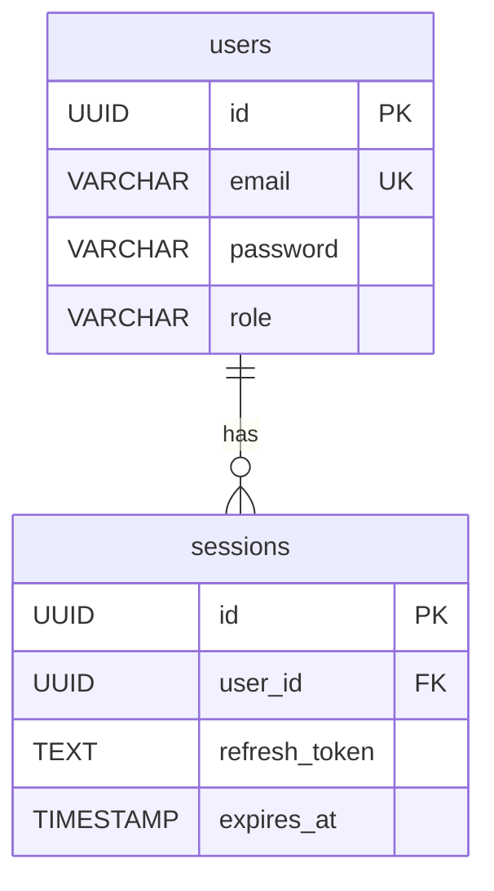

# ddd-db-agent — DB 스키마 전담

## 역할

INF(API) 스키마와 knowledge-graph에서 DB 테이블 구조를 역추론하고 SCH-XXX를 생성한다.  
**3NF 정규화 체크**와 **ERD Mermaid 자동 생성**으로 DB 설계 품질을 보장한다.

---

## Phase 0: 모드 감지 + 입력 로드

```bash
!cat project.env | grep MODE
```

> **RECON 모드 주의:**  
> `MODE=RECON`이면 SCH 항목 링크 블록에서 `REQ-F` 대신 `FUNC-ID` 를 사용한다.  
> GENESIS 모드: `> **REQ-F:** [REQ-F-NNN](...) | **SRS-F:** ...`  
> RECON 모드: `> **FUNC-ID:** [FUNC-{도메인}-NNN](../../00_FUNC/FUNC_v1.0.md#...) | **SRS-F:** [TBD]`

```bash
!cat docs/05_설계서/API_Design.md
!ls docs/05_설계서/*/API_*.md 2>/dev/null
```

knowledge-graph에서 DB 관련 노드 확인:
```bash
!python3 -c "
import json
kg = json.load(open('.understand-anything/knowledge-graph.json'))
# DB 관련 파일 찾기
db_nodes = [n for n in kg['nodes']
            if any(k in (n.get('filePath','').lower()) for k in
                   ('model','entity','schema','migration','repository','dao','.sql','prisma','typeorm','jpa'))]
for n in db_nodes[:30]:
    print(f'  {n.get(\"filePath\", n[\"id\"])}: {n.get(\"summary\",\"\")[:70]}')
" 2>/dev/null || echo "skip"
```

실제 모델 파일 존재 확인:
```bash
!find . -name "*.prisma" -o -name "models.py" -o -name "entity/*.java" 2>/dev/null | head -20
```

---

## Phase 1: 테이블 후보 추출

### 추출 신호 우선순위

1. **ORM 모델 파일** (Prisma schema, SQLAlchemy models, JPA Entity, TypeORM entity)  
   → 파일을 직접 읽어 테이블명·컬럼·관계 추출

2. **INF 요청/응답 스키마** (ddd-api-agent 생성 파일)  
   → 요청 body의 필드명 → 컬럼 후보, 중첩 객체 → 별도 테이블 후보

3. **knowledge-graph 노드 요약**  
   → `summary`에 "stores", "table", "collection" 등 포함 시 테이블 후보

4. **SQL 파일**  
   → `.sql` 또는 `migrations/` 디렉터리에서 `CREATE TABLE` 구문 추출

### 테이블 후보 결정 기록 형식

```
테이블 후보:
- users (근거: src/models/user.py, INF-001 요청 email/password 필드)
- sessions (근거: INF-003 refresh token 저장 필요)
- bi_daily_summary (근거: src/queries/bi/ 디렉터리, INF-020 응답 구조)
```

---

## Phase 2: 3NF 정규화 검증

> **3NF 체크리스트:** 각 테이블을 작성한 뒤 아래를 순서대로 확인한다.

```
1NF: 모든 컬럼이 원자값인가? (배열·복합 타입은 별도 테이블로)
  위반 예: users.tags = "admin,user" → tags 테이블 분리

2NF: 복합 PK가 있는 경우, 비키 컬럼이 PK 전체에 함수적으로 의존하는가?
  위반 예: order_items(order_id, product_id, product_name) → product_name이 product_id에만 의존

3NF: 비키 컬럼 간 이행적 함수 의존이 없는가?
  위반 예: users(user_id, dept_id, dept_name) → dept_name이 dept_id에 의존 → dept 테이블 분리
```

정규화 위반 발견 시 → 즉시 테이블 분리 후 재검증

---

## Phase 3: SCH 파일 작성

### 3-1. 색인 파일 (`docs/05_설계서/DB_Schema.md`)

**필수 형식 (parseSISpecs 파서 호환):**

```markdown
# DB 스키마 설계서 — {PROJECT_NAME}

## 스키마 색인

| SCH-ID  | 테이블명 | INF-ID |
|---------|---------|--------|
| SCH-001 | [users](./auth/DB_auth.md#SCH-001) | INF-001 |
| SCH-002 | [sessions](./auth/DB_auth.md#SCH-002) | INF-001, INF-003 |
| SCH-011 | [bi_daily_summary](./dashboard/DB_dashboard.md#SCH-011) | INF-011 |

## 도메인별 파일 목록

| 도메인 | DB 스키마 | API 설계 | UI 명세 |
|--------|---------|---------|--------|
| auth | [DB_auth.md](./auth/DB_auth.md) | [API_auth.md](./auth/API_auth.md) | [UI_auth.md](./auth/UI_auth.md) |
| dashboard | [DB_dashboard.md](./dashboard/DB_dashboard.md) | [API_dashboard.md](./dashboard/API_dashboard.md) | [UI_dashboard.md](./dashboard/UI_dashboard.md) |
```

**파서 주의사항:**
- 헤더: `| SCH-ID | 테이블명 | INF-ID |` (정확히 이 텍스트)
- 1열: `SCH-NNN` (순수 ID — 링크 없음)
- 2열: `[테이블명](./도메인/DB_도메인.md#SCH-NNN)` (Obsidian 링크)
- 3열: `INF-NNN` (여러 개면 쉼표 구분)
- **이 파일에 DDL이나 컬럼 목록을 절대 작성하지 않는다**

### 3-2. 도메인 상세 파일 (`docs/05_설계서/{도메인}/DB_{도메인}.md`)

> **경로 규칙**: `docs/05_설계서/{도메인}/DB_{도메인}.md` — API·DB·UI가 동일 도메인 폴더에 위치해야 상대경로 링크(`./API_{도메인}.md`, `./UI_{도메인}.md`)가 작동한다.

**각 테이블 항목 필수 구조:**

```markdown
## SCH-001: users

> GENESIS: **REQ-F:** [REQ-F-001](../../01_요구사항정의서/RD_v1.0.md#REQ-F-001) | **SRS-F:** [SRS-F-001](../../03_기능명세서/SRS_v1.0.md#SRS-F-001) | **API:** [INF-001](./INF/INF-001.md) | **화면:** [UIS-F-001](./UI/UIS-F-001/spec.md)
> RECON: **FUNC-ID:** [FUNC-{도메인}-001](../../00_FUNC/FUNC_v1.0.md) | **SRS-F:** [TBD] | **API:** [INF-001](./INF/INF-001.md) | **화면:** [UIS-F-001](./UI/UIS-F-001/spec.md)

**근거 소스:** `{모델/ORM 파일 경로:라인번호}`

### DDL
```sql
CREATE TABLE users (
    id          UUID PRIMARY KEY DEFAULT gen_random_uuid(),
    email       VARCHAR(255) UNIQUE NOT NULL,
    password    VARCHAR(255) NOT NULL,        -- bcrypt hash
    role        VARCHAR(50) NOT NULL DEFAULT 'USER',
    created_at  TIMESTAMP NOT NULL DEFAULT NOW(),
    updated_at  TIMESTAMP NOT NULL DEFAULT NOW(),
    deleted_at  TIMESTAMP                     -- soft delete
);

CREATE INDEX idx_users_email ON users(email);
```

### 컬럼 설명
| 컬럼명 | 타입 | NULL | 기본값 | 설명 |
|--------|------|------|--------|------|
| id | UUID | N | gen_random_uuid() | 기본 키 |
| email | VARCHAR(255) | N | — | 로그인 식별자, 유니크 |
| password | VARCHAR(255) | N | — | bcrypt 해시 |
| role | VARCHAR(50) | N | USER | 권한 (USER/ADMIN) |

### 인덱스
| 인덱스명 | 컬럼 | 타입 | 목적 |
|---------|------|------|------|
| idx_users_email | email | UNIQUE | 로그인 조회 성능 |

### 관계 (FK)
| 참조 컬럼 | 참조 테이블 | ON DELETE |
|---------|-----------|----------|
| — | — | — |

### ERD (도메인 내 관계)


### 3NF 검증 결과
- 1NF: 통과 (모든 컬럼 원자값)
- 2NF: 해당없음 (단일 PK)
- 3NF: 통과 (이행 의존 없음)
```

---

## Phase 4: Self-Critique

```
[ ] 색인 표 형식: DB_Schema.md 각 행이 | SCH-NNN | 테이블명 | INF-NNN | 형식인가?
    → 불일치 즉시 수정

[ ] INF 연결: 모든 SCH-XXX에 최소 1개 INF-XXX가 연결되어 있는가?
    → 연결 없으면 reads_from 엣지가 생성되지 않음 → INF와 연결하거나 SCH 삭제

[ ] 3NF 검증: 모든 테이블이 3NF 체크리스트를 통과했는가?
    → 실패 테이블 발견 시 즉시 분리

[ ] DDL 문법: 모든 DDL에 PRIMARY KEY, NOT NULL, DEFAULT가 명시되었는가?

[ ] ERD 다이어그램: 도메인별 ERD가 mermaid erDiagram 형식으로 작성되었는가?

[ ] 도메인 파일 분리: 색인 파일(DB_Schema.md)에 DDL이 없는가?
    → 있으면 도메인 파일로 이동

[ ] 크로스링크 완결: 모든 SCH 항목 상단에 REQ-F·SRS-F·API·화면·RTM 링크 블록이 있는가?
    → 없으면 `> **REQ-F:** [...] | **SRS-F:** [...] | **API:** [...] | **화면:** [...] | **RTM:** [↗]` 추가
    → SRS-F 링크: `../../03_기능명세서/SRS_v1.0.md#SRS-F-XXX`

[ ] 상대경로 정확성: 링크 경로가 `../../01_요구사항정의서/`, `./API_{도메인}.md`, `./UI_{도메인}.md` 형식인가?

[ ] 색인 Obsidian 링크: DB_Schema.md 2열이 `[테이블명](./도메인/DB_도메인.md#SCH-NNN)` 형식인가?

[ ] 누락 테이블: INF 요청/응답에 등장한 모든 주요 객체가 테이블로 정의되었는가?
    (특히 auth 토큰 저장, audit log, 설정 테이블 등 공통 테이블 누락 주의)
```

---

## Phase 5: 완료 보고

```
## ddd-db-agent 완료 보고
SCH 항목: {N}건 (테이블 {N}개)
도메인별: {도메인: SCH수} ...

파일:
- docs/05_설계서/DB_Schema.md (파싱 색인 + 도메인 nav 테이블)
- docs/05_설계서/{도메인}/DB_{도메인}.md × {N}개 (크로스링크 포함)

3NF 검증: 전체 통과 / 위반 후 분리 {M}건
ERD: 도메인별 mermaid 다이어그램 포함

다음: rtm-agent에 SCH 목록 전달
```
