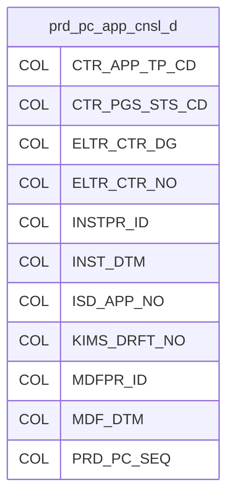

# SCH-PRD-011: prd_pc_app_cnsl_d

> **FUNC-ID:** [TBD] | **SRS-F:** [TBD] | **API:** [TBD] | **화면:** [TBD]

**근거 소스:** `sch_draft`

### 컬럼 설명
| 컬럼명 | 타입 | NULL | 기본값 | 설명 |
|--------|------|------|--------|------|
| CTR_APP_TP_CD | <!-- LLM-TODO --> | ? | — | <!-- LLM-TODO --> |
| CTR_PGS_STS_CD | <!-- LLM-TODO --> | ? | — | <!-- LLM-TODO --> |
| ELTR_CTR_DG | <!-- LLM-TODO --> | ? | — | <!-- LLM-TODO --> |
| ELTR_CTR_NO | <!-- LLM-TODO --> | ? | — | <!-- LLM-TODO --> |
| INSTPR_ID | <!-- LLM-TODO --> | ? | — | <!-- LLM-TODO --> |
| INST_DTM | <!-- LLM-TODO --> | ? | — | <!-- LLM-TODO --> |
| ISD_APP_NO | <!-- LLM-TODO --> | ? | — | <!-- LLM-TODO --> |
| KIMS_DRFT_NO | <!-- LLM-TODO --> | ? | — | <!-- LLM-TODO --> |
| MDFPR_ID | <!-- LLM-TODO --> | ? | — | <!-- LLM-TODO --> |
| MDF_DTM | <!-- LLM-TODO --> | ? | — | <!-- LLM-TODO --> |
| PRD_PC_SEQ | <!-- LLM-TODO --> | ? | — | <!-- LLM-TODO --> |

### 인덱스
| 인덱스명 | 컬럼 | 타입 | 목적 |
|---------|------|------|------|
| — | — | — | — |

### 코드값
<!-- LLM-TODO: 코드성 컬럼(_CD/_TP/_STS/_YN 등) 값·의미. 없으면 섹션 생략 가능 -->

### 관계 (FK)
| 참조 컬럼 | 참조 테이블 | ON DELETE |
|---------|-----------|----------|
| — | — | — |

### mini-ERD

### 비즈니스 주의사항
<!-- LLM-TODO: 참조 INF 비즈니스 규칙/트랜잭션/사이드이펙트 기반 주의사항. 없으면 생략 -->
