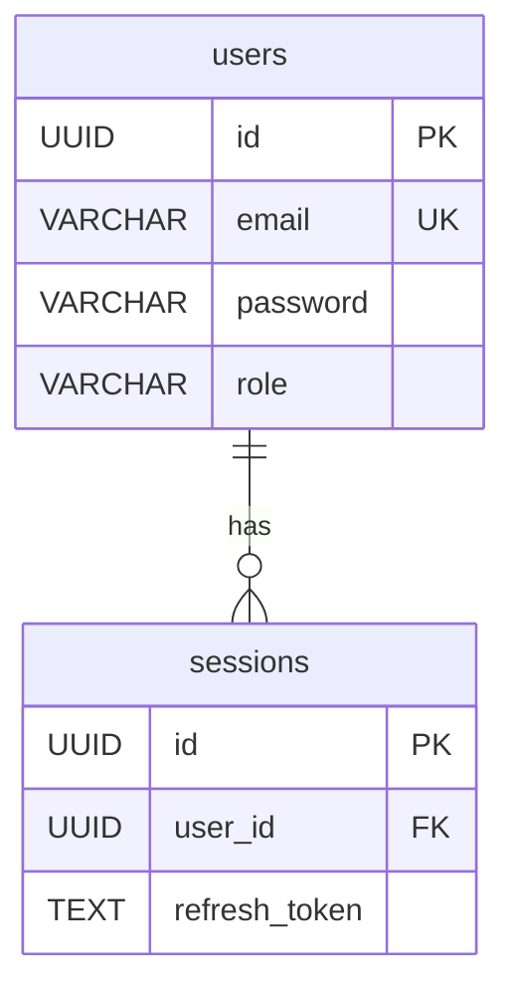

# DB 스키마 설계서 색인 (DB Schema Index)

> **문서 목적**: parseSISpecs 파싱용 3열 색인만 담는다.  
> 상세 DDL·컬럼 정의는 각 도메인 파일로 이동. **이 파일에 DDL 절대 작성 금지.**

---

## 스키마 색인 (parseSISpecs 파싱 대상)

> **파싱 규약**: `si-spec-parser`가 이 표를 읽어 `sch` 노드와 `INF→SCH reads_from` 엣지를 생성한다.  
> 3열 형식 고정: `| SCH-XXX | 테이블명 | INF-XXX |`  
> **Obsidian 링크**: 2열을 `[테이블명](./도메인/DB_도메인.md#SCH-XXX)` 형식으로 작성

| SCH-ID  | 테이블명 | INF-ID |
|---------|---------|--------|
| SCH-001 | [users](./auth/DB_auth.md#SCH-001) | INF-001 |
| SCH-002 | [sessions](./auth/DB_auth.md#SCH-002) | INF-001, INF-003 |
| SCH-011 | [bi_daily_summary](./dashboard/DB_dashboard.md#SCH-011) | INF-011 |

---

## 도메인별 파일 목록

| 도메인 | DB 스키마 | API 설계 | UI 명세 |
|--------|---------|---------|--------|
| auth | [DB_auth.md](./auth/DB_auth.md) | [API_auth.md](./auth/API_auth.md) | [UI_auth.md](./auth/UI_auth.md) |
| dashboard | [DB_dashboard.md](./dashboard/DB_dashboard.md) | [API_dashboard.md](./dashboard/API_dashboard.md) | [UI_dashboard.md](./dashboard/UI_dashboard.md) |

---

## DB 개요

| 항목 | 내용 |
|------|------|
| DBMS | {MySQL 8.x / PostgreSQL 15 / Oracle} |
| 문자셋 | UTF8MB4 |
| 스키마명 | {schema_name} |
| 테이블 수 | {N}개 |

---

## 공통 컬럼 규칙

> 모든 테이블에 아래 컬럼을 반드시 포함한다.

| 컬럼명 | 타입 | 설명 |
|--------|------|------|
| id | BIGINT AUTO_INCREMENT | 기본키 |
| created_at | DATETIME | 생성일시 |
| updated_at | DATETIME | 최종 수정일시 |
| created_by | VARCHAR(50) | 생성자 ID |
| is_deleted | TINYINT(1) | 논리 삭제 플래그 (0: 정상, 1: 삭제) |

## 네이밍 규칙

| 대상 | 규칙 | 예시 |
|------|------|------|
| 테이블명 | snake_case, 복수형 | users, order_items |
| 컬럼명 | snake_case | user_name, created_at |
| PK | id | id |
| FK | {참조테이블 단수}_id | user_id, order_id |
| 인덱스 | idx_{테이블}_{순번} | idx_users_01 |

---

## 변경 이력

| 버전 | 날짜 | 변경 내용 | 작성자 |
|------|------|----------|--------|
| 1.0 | YYYY-MM-DD | 최초 작성 | |

---

> **연결 문서**: [RD](../01_요구사항정의서/RD_v1.0.md) | [SRS](../03_기능명세서/SRS_v1.0.md) | [API 설계](./API_Design.md) | [UI 명세](./UI_Spec_v1.0.md) | [RTM](../02_추적표/RTM_v1.0.md) | [SAD](../04_아키텍처설계서/SAD_v1.0.md)

---

# 도메인별 DB 상세 파일 템플릿

> 아래는 `docs/05_설계서/{도메인}/DB_{도메인}.md` 파일에 작성할 형식이다.

---

## SCH-001: users

> **REQ-F:** [REQ-F-001](../../01_요구사항정의서/RD_v1.0.md#REQ-F-001) | **SRS-F:** [SRS-F-001](../../03_기능명세서/SRS_v1.0.md#SRS-F-001) | **API:** [INF-001](./API_{도메인}.md#INF-001), [INF-003](./API_{도메인}.md#INF-003) | **화면:** [UIS-F-001](./UI_{도메인}.md#UIS-F-001) | **RTM:** [↗](../../02_추적표/RTM_v1.0.md)

### DDL
```sql
CREATE TABLE users (
    id          UUID PRIMARY KEY DEFAULT gen_random_uuid(),
    email       VARCHAR(255) UNIQUE NOT NULL,
    password    VARCHAR(255) NOT NULL,
    role        VARCHAR(50) NOT NULL DEFAULT 'USER',
    created_at  TIMESTAMP NOT NULL DEFAULT NOW(),
    updated_at  TIMESTAMP NOT NULL DEFAULT NOW(),
    deleted_at  TIMESTAMP
);
CREATE INDEX idx_users_email ON users(email);
```

### 컬럼 설명
| 컬럼명 | 타입 | NULL | 기본값 | 설명 |
|--------|------|------|--------|------|
| id | UUID | N | gen_random_uuid() | 기본 키 |
| email | VARCHAR(255) | N | — | 로그인 식별자, 유니크 |
| password | VARCHAR(255) | N | — | bcrypt 해시 |
| role | VARCHAR(50) | N | USER | 권한 (USER/ADMIN) |

### 인덱스
| 인덱스명 | 컬럼 | 타입 | 목적 |
|---------|------|------|------|
| idx_users_email | email | UNIQUE | 로그인 조회 성능 |

### 관계 (FK)
| 참조 컬럼 | 참조 테이블 | ON DELETE |
|---------|-----------|----------|
| — | — | — |

### ERD (도메인 내 관계)


### 3NF 검증 결과
- 1NF: 통과
- 2NF: 해당없음 (단일 PK)
- 3NF: 통과

---

## SCH-002: {table_name_2}

> **REQ-F:** [REQ-F-XXX](../../01_요구사항정의서/RD_v1.0.md#REQ-F-XXX) | **SRS-F:** [SRS-F-XXX](../../03_기능명세서/SRS_v1.0.md#SRS-F-XXX) | **API:** [INF-XXX](./API_{도메인}.md#INF-XXX) | **화면:** [UIS-F-XXX](./UI_{도메인}.md#UIS-F-XXX) | **RTM:** [↗](../../02_추적표/RTM_v1.0.md)

### DDL
```sql
CREATE TABLE {table_name_2} (
    id BIGINT PRIMARY KEY AUTO_INCREMENT,
    created_at DATETIME NOT NULL DEFAULT CURRENT_TIMESTAMP,
    updated_at DATETIME NOT NULL DEFAULT CURRENT_TIMESTAMP ON UPDATE CURRENT_TIMESTAMP
);
```

### 컬럼 설명
| 컬럼명 | 타입 | NULL | 기본값 | 설명 |
|--------|------|------|--------|------|
| id | BIGINT | N | AUTO_INCREMENT | 기본 키 |
