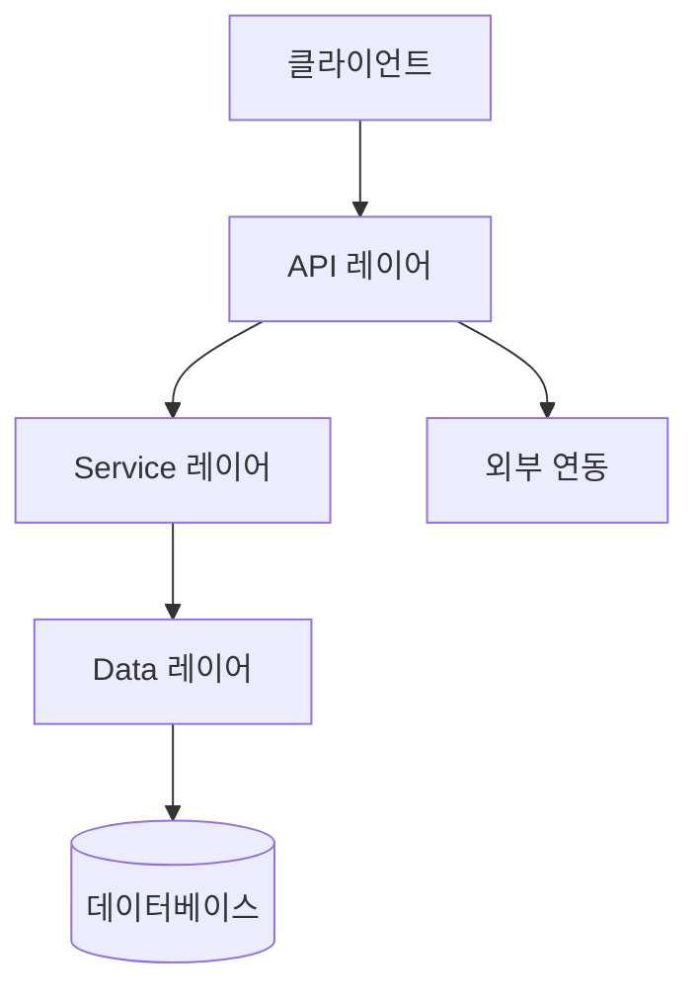
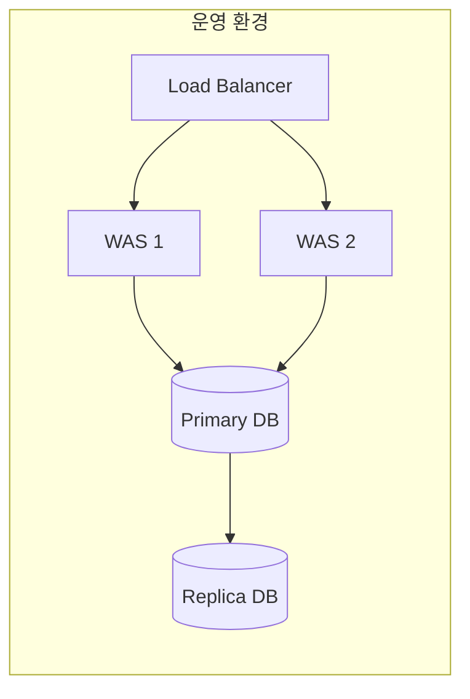

# 시스템 아키텍처 설계서 (System Architecture Document)

> **문서 목적**: 시스템 전체 구조를 정의하여 개발팀은 구현 기준으로,
> PM·고객사는 시스템 구성을 이해하는 문서로 활용한다.
> Understand-Anything 지식 그래프 분석 결과를 기반으로 자동 생성된다.

---

## 1. 아키텍처 개요

| 항목 | 내용 |
|------|------|
| 아키텍처 패턴 | {Layered / MVC / MSA / Hexagonal} |
| 배포 환경 | {On-Premise / Cloud / Hybrid} |
| 핵심 기술 스택 | {언어, 프레임워크, DB} |
| UA 분석 일자 | YYYY-MM-DD |

**아키텍처 한 줄 설명**

> {시스템이 어떤 구조로 동작하는지 PM·고객사가 이해할 수 있는 언어로 1~2문장}

---

## 2. 레이어 구성

> Understand-Anything 자동 분류 결과

| 레이어 | 역할 | 주요 컴포넌트 | 파일 수 |
|--------|------|-------------|--------|
| API 레이어 | 외부 요청 수신·응답 | Controller, Router | |
| Service 레이어 | 비즈니스 로직 처리 | Service, UseCase | |
| Data 레이어 | 데이터 저장·조회 | Repository, DAO | |
| UI 레이어 | 화면 렌더링 | Component, Page | |
| Utility 레이어 | 공통 유틸리티 | Helper, Util | |

---

## 3. 컴포넌트 다이어그램

> UA 지식 그래프 기반 자동 생성

---

## 4. 주요 컴포넌트 상세

### 4.1 {컴포넌트명}

| 항목 | 내용 |
|------|------|
| 컴포넌트 ID | COMP-001 |
| 레이어 | {레이어명} |
| 파일 경로 | {src/...} |
| 연결 FUNC-ID | FUNC-001 |
| 역할 | {무엇을 하는지} |
| 의존 컴포넌트 | {COMP-002, COMP-003} |

### 4.2 {컴포넌트명}

| 항목 | 내용 |
|------|------|
| 컴포넌트 ID | COMP-002 |
| 레이어 | |
| 파일 경로 | |
| 연결 FUNC-ID | |
| 역할 | |
| 의존 컴포넌트 | |

---

## 5. 기술 스택

| 구분 | 기술 | 버전 | 선정 이유 |
|------|------|------|----------|
| 언어 | | | |
| 프레임워크 | | | |
| ORM / DB 접근 | | | |
| 데이터베이스 | | | |
| 캐시 | | | |
| 메시지 큐 | | | |
| 인증 | | | |
| 배포 | | | |

---

## 6. 외부 연동 목록

| 연동 시스템 | 방식 | 프로토콜 | 연결 FUNC-ID | 비고 |
|-----------|------|----------|------------|------|
| | REST / SOAP / MQ | HTTP / HTTPS | | |

---

## 7. 보안 설계 요약

| 항목 | 적용 방식 |
|------|----------|
| 인증 방식 | {JWT / OAuth2 / Session} |
| 인가 방식 | {RBAC / ABAC} |
| 암호화 | {TLS 1.3 / AES-256} |
| 감사 로그 | {적용 여부 및 범위} |

---

## 8. 배포 아키텍처

---

## 9. 변경 이력

| 버전 | 날짜 | 변경 내용 | 변경 원인 | 작성자 |
|------|------|----------|----------|--------|
| 1.0 | YYYY-MM-DD | 최초 작성 (UA 역방향 분석) | | |

---

> **연결 문서**: [SRS](../03_기능명세서/SRS_v1.0.md) | [RTM](../02_추적표/RTM_v1.0.md) | [DDD](../05_설계서/)
